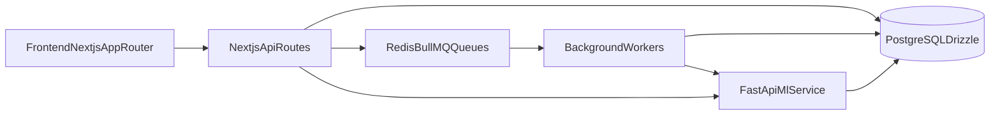

# SmartBasket Architecture

This document describes the current implementation architecture of SmartBasket based on the repository code (Next.js web/API + BullMQ workers + FastAPI ML service + PostgreSQL/Drizzle).

## System Overview

SmartBasket is an event-driven commerce platform. User activity is continuously captured, persisted, and transformed into recommendation signals.

## Core Layers

### 1) Frontend Layer

Primary implementation is in `apps/web`:

- UI + routing: Next.js App Router (`apps/web/app`)
- Client state: Zustand
- Server state/cache: TanStack Query
- Tracking SDK: `apps/web/lib/tracking/event-tracker.ts`

Design split:

- UI state is local/client-focused
- server state is query-cached and invalidated via API events

### 2) Backend Layer (Next.js API)

Route handlers live under `apps/web/app/api`.

Major route groups:

- auth: login/register/refresh/logout/forgot-password
- catalog/search/recommendations
- user account/cart/wishlist/orders
- admin products/orders/stats/analytics/uploads
- event ingestion (`/api/events`)
- worker control/status (`/api/workers`)

Code organization combines:

- module-style slices (`src/modules/*`: controller/service/repository)
- shared operational services (`lib/services/*`)
- typed DB query package (`@workspace/db/queries/*`)

### 3) Database Layer

DB package: `packages/db`

- client bootstrap: `packages/db/src/client.ts`
- schema: `packages/db/src/schema/*.ts`
- query modules: `packages/db/src/queries/*.ts`

Key table groups:

- identity/core: `users`, `categories`, `products`
- commerce: `carts`, `cart_items`, `orders`, `order_items`
- event logs: `product_views`, `cart_events`, `wishlist_events`, `search_logs`, `user_sessions`, `user_events`
- recommendation/ML: `user_profiles`, `recommendation_cache`, `product_embeddings`, `user_embeddings`, `preferences`
- analytics/tagging: `product_tag_signals`, `tag_insights`, `category_insights`
- notifications: `email_logs`

Indexing:

- btree indexes on FK/time/action columns
- pgvector with ivfflat cosine indexes for embeddings

### 4) Event Tracking Pipeline

Flow:

UI -> `POST /api/events` -> event normalization -> multi-table inserts -> queue dispatch

Concrete components:

- API entry: `apps/web/app/api/events/route.ts`
- orchestrator: `apps/web/lib/services/event-tracking.service.ts`
- normalizer: `apps/web/lib/tracking/event-normalizer.ts`
- queue fan-out: `apps/web/lib/workers/event-dispatcher.ts`

Captured events include:

- product views (duration/source)
- cart add/update/remove
- wishlist add/remove
- search queries + selection context
- session lifecycle
- generic user event audit trail

Why it matters:

- drives user profile aggregation
- powers recommendation precompute and cache freshness
- provides ML training and retrieval context

### 5) Background Workers

Queue definitions: `apps/web/lib/workers/queues.ts`  
Worker startup: `apps/web/lib/workers/worker-processors.ts`  
Redis resolver: `apps/web/lib/workers/redis.ts`

Queues/jobs:

- `profile-aggregation`
- `embedding-generation`
- `recommendation-precompute`
- `session-cleanup`
- `cache-cleanup`
- `generate-product-tags`
- `tag-signal-update`
- `tag-insights-refresh`
- `email-delivery`

Specialized workers:

- tagging worker: `apps/web/src/workers/tagging.worker.ts`
- email worker: `apps/web/src/workers/email.worker.ts`

### 6) ML Layer (FastAPI)

Service root: `apps/ai`

- app init/router registration: `apps/ai/app/main.py`
- recommendation router: `apps/ai/app/routers/recommendations.py`
- similar products router: `apps/ai/app/routers/similar.py`
- rerank router: `apps/ai/app/routers/search.py`
- embeddings router: `apps/ai/app/routers/embeddings.py`
- tagging router: `apps/ai/app/routers/tagging.py`

Core behaviors:

- cold-start and hybrid recommendation strategy
- similar-product retrieval via embedding distance + fallback
- query reranking using semantic similarity
- single and batch embedding generation with DB upserts

Data sources:

- `products`
- `user_events`
- `user_profiles`
- `product_embeddings`

### 7) Email System

Queue-first delivery architecture:

- enqueue: `apps/web/src/queues/email.queue.ts`
- worker execution: `apps/web/src/workers/email.worker.ts`
- provider integration: `apps/web/src/services/email.service.tsx`
- delivery tracking: `email_logs` table + `packages/db/src/queries/email-log.ts`

Email types currently wired:

- order confirmation
- order shipped
- password reset
- admin onboarding

### 8) Storage Layer

Upload abstraction:

- `apps/web/src/services/upload.service.ts`

Provider selection:

- `UPLOAD_PROVIDER` (`r2` default, `cloudinary`, `imagekit`)

R2 path:

- AWS SDK S3-compatible upload using account/bucket credentials

Cloudinary/ImageKit path:

- base-URL based path composition in current implementation

Admin upload endpoint:

- `apps/web/app/api/admin/uploads/products/[productId]/route.ts`

### 9) Auth System

Token/cookie stack:

- token signing/verification: `apps/web/src/lib/auth/tokens.ts`
- refresh cookie config: `apps/web/src/lib/auth/cookies.ts`
- cookie naming: `apps/web/src/config/auth-edge.ts`
- API guard helpers:
  - admin: `apps/web/src/lib/auth/admin-guard.ts`
  - user: `apps/web/src/lib/auth/api-auth.ts`

Flow:

- login issues access JWT + refresh JWT cookie
- refresh route validates/rotates refresh token
- protected routes validate access token and role requirements

## Data Flow Diagrams (Textual)

### Product interaction to recommendation update

1. User views product in UI.
2. Tracking SDK batches and posts to `/api/events`.
3. Event service writes `product_views` and `user_events`.
4. Event dispatcher enqueues profile/recommendation/tag signal jobs.
5. Workers refresh `user_profiles` and `recommendation_cache`.
6. Recommendations API returns fresh or cached recommendations.

### Purchase and communication flow

1. User creates order via `/api/orders`.
2. Backend persists order + items in DB.
3. Email log row is created.
4. `email-delivery` queue receives job payload.
5. Email worker renders template and calls Resend.
6. `email_logs` status updates to `sent` or `failed`.

## Scalability Considerations

- stateless API handlers with externalized state (DB + Redis)
- asynchronous workers for expensive and retryable work
- recommendation cache table to reduce hot-path recomputation
- DB indexing for high-cardinality event access paths
- client-side server-state caching via TanStack Query
- ML service can scale independently from Next.js app

## Security Considerations

- refresh token stored in HTTP-only cookie
- access token is short-lived and rotated through refresh flow
- RBAC checks at admin/user route boundaries
- zod validation on input DTOs in route handlers
- secrets loaded from env (no hardcoded production secrets expected)
- seed runner has production execution guard
